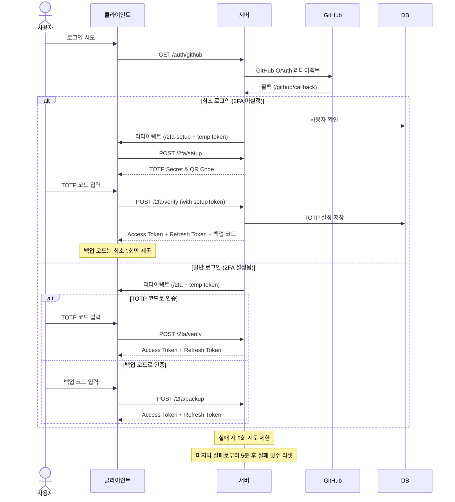
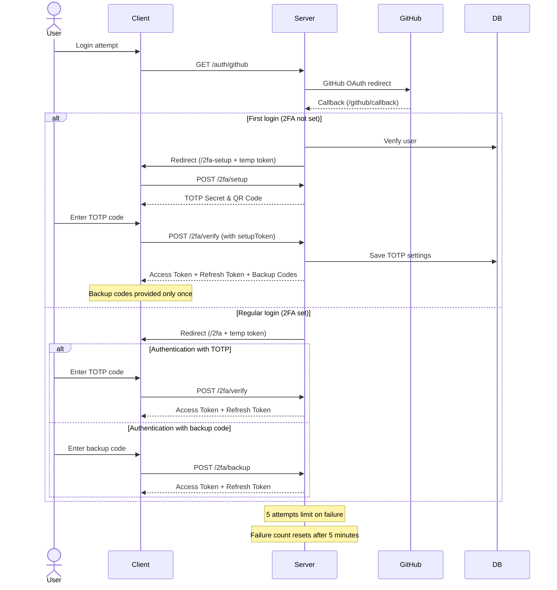
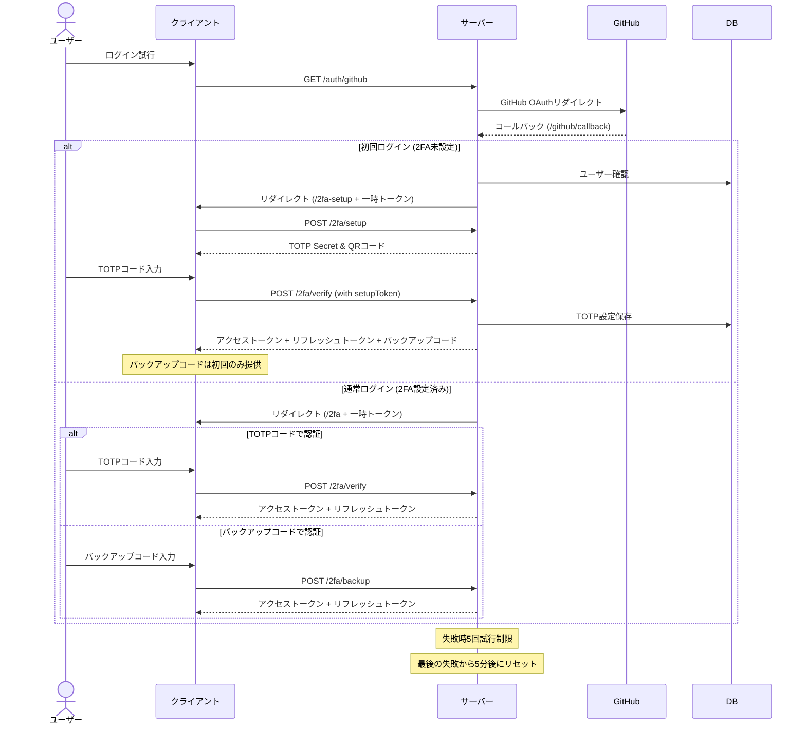

# Auth Module

[한국어](#한국어) | [English](#english) | [日本語](#日本語)

---

# 한국어

## 개요

관리자 인증을 위한 모듈입니다. GitHub OAuth를 통한 소셜 로그인과 2FA(TOTP) 인증을 필수로 합니다.

## 주요 기능

### 1. 인증 시스템

- GitHub OAuth 기반 소셜 로그인
- TOTP 기반의 2단계 인증(2FA)
- 백업 코드 시스템
- JWT 기반의 토큰 시스템

### 2. 토큰 시스템

| 토큰 종류       | 용도                  |
| --------------- | --------------------- |
| Temporary Token | 2FA 인증 전 임시 토큰 |
| Access Token    | API 접근용 토큰       |
| Refresh Token   | 토큰 갱신용           |

### 3. 인증 플로우

### 4. 설정 및 제한사항

#### 토큰 만료 시간

| 토큰 종류       | 만료 시간 |
| --------------- | --------- |
| Temporary Token | 10분      |
| Access Token    | 15분      |
| Refresh Token   | 7일       |

#### 보안 정책

- TOTP 인증 시도
  - 최대 실패 횟수: 5회
  - 실패 횟수 리셋: 마지막 시도로부터 5분 후
- 백업 코드
  - 생성 개수: 8개
  - 최초 설정 시에만 제공

---

# English

## Overview

Authentication module for administrator access. Requires social login through GitHub OAuth and 2FA(TOTP) authentication.

## Key Features

### 1. Authentication System

- GitHub OAuth-based social login
- TOTP-based two-factor authentication (2FA)
- Backup code system
- JWT-based token system

### 2. Token System

| Token Type      | Purpose                    |
| --------------- | -------------------------- |
| Temporary Token | Temporary token before 2FA |
| Access Token    | API access token           |
| Refresh Token   | Token renewal              |

### 3. Authentication Flow

### 4. Configuration and Limitations

#### Token Expiration Times

| Token Type      | Expiration |
| --------------- | ---------- |
| Temporary Token | 10 minutes |
| Access Token    | 15 minutes |
| Refresh Token   | 7 days     |

#### Security Policies

- TOTP Authentication Attempts
  - Maximum failure count: 5 times
  - Failure count reset: 5 minutes after last attempt
- Backup Codes
  - Generated amount: 8 codes
  - Provided only during initial setup

---

# 日本語

## 概要

管理者認証のためのモジュールです。GitHub OAuthによるソーシャルログインと2FA(TOTP)認証を必須とします。

## 主な機能

### 1. 認証システム

- GitHub OAuthベースのソーシャルログイン
- TOTPベースの二要素認証(2FA)
- バックアップコードシステム
- JWTベースのトークンシステム

### 2. トークンシステム

| トークン種類         | 用途                    |
| -------------------- | ----------------------- |
| 一時トークン         | 2FA認証前の一時トークン |
| アクセストークン     | API アクセス用          |
| リフレッシュトークン | トークン更新用          |

### 3. 認証フロー

### 4. 設定と制限事項

#### トークン有効期限

| トークン種類         | 有効期限 |
| -------------------- | -------- |
| 一時トークン         | 10分     |
| アクセストークン     | 15分     |
| リフレッシュトークン | 7日      |

#### セキュリティポリシー

- TOTP認証試行
  - 最大失敗回数: 5回
  - 失敗回数リセット: 最後の試行から5分後
- バックアップコード
  - 生成数: 8個
  - 初期設定時のみ提供
